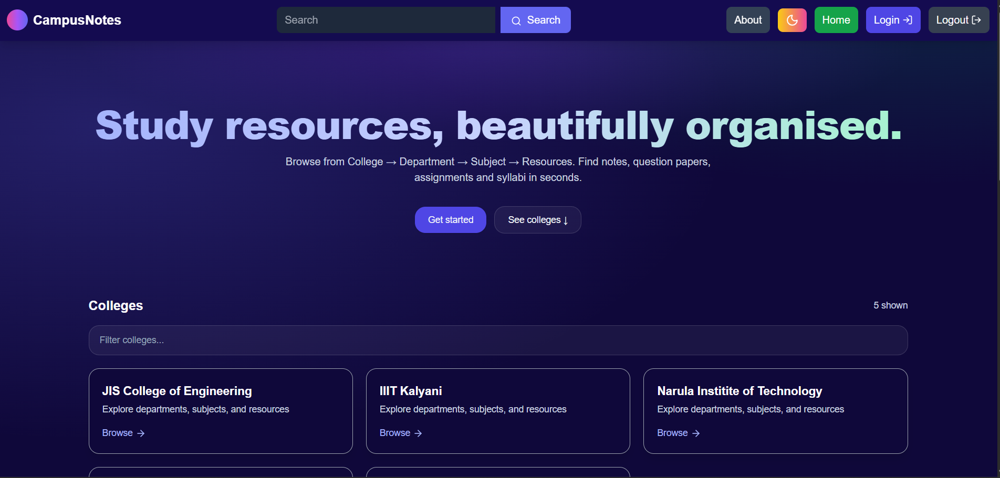

# 📚 CampusNotes – College Resource Hub

CampusNotes is a **React + Tailwind** based web application designed to help students across **all Indian colleges** access exam-related resources in one place.  
From **1st year to final year**, students can browse **notes, previous year question papers, and subject-wise PDFs**—all structured by **College → Department → Subject → Resources**.  

---

## 🚀 Features
- 🏫 **Multi-College Support** – Browse resources from colleges across India  
- 🏬 **Department-wise Navigation** – IT, CSE, ECE, Mechanical, Civil, etc.  
- 📚 **Subject Organization** – Semester & year-based subject categorization  
- 📂 **Exam Resources** – Notes, Question Papers, Syllabus, Assignments (all in PDF)  
- 🔍 **Search & Filter** – Quickly find resources across colleges/departments  
- 🌙 **Dark Mode** – User-friendly modern UI with theme toggle  
- 📖 **PDF Preview & Download** – Open or download resources directly  

---

## 🛠️ Tech Stack
- **Frontend:** React.js, Tailwind CSS  
- **Icons:** Lucide React  
- **Routing (Planned):** React Router  
- **Future Backend (Optional):** Node.js, Express, MongoDB  

---

## 🎯 Example Flow
1. Select your **College** (e.g., JIS College of Engineering)  
2. Choose a **Department** (e.g., IT Department)  
3. Pick a **Semester/Subject** (e.g., Data Structures – Sem 3)  
4. Access **Notes, Previous Papers, PDFs**  

---

## 🏆 Highlights for Resume
- Designed a **scalable frontend architecture** for multi-level navigation  
- Implemented **dark mode, search, and PDF preview** for usability  
- Built a **pan-India college resource hub** with focus on **exam preparation**  

---

## 📸 Project Preview



---

## ⚡ Getting Started
```bash
# Clone repo
git clone https://github.com/Sitaram8472/Campus_Notes
cd campusnotes

# Install dependencies
npm install

# Start dev server
npm run dev
